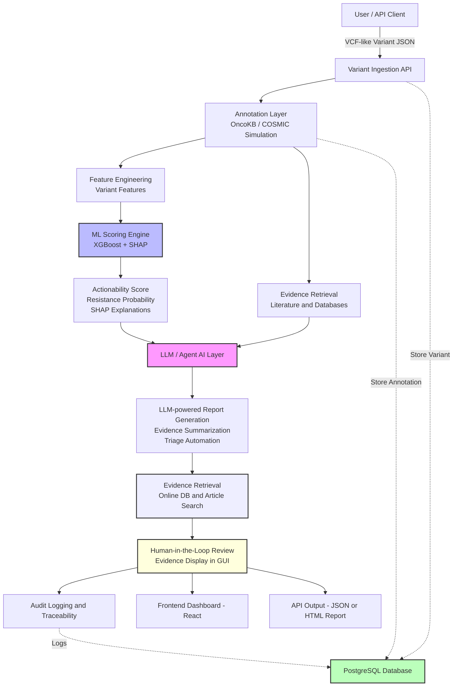

#

# Project Goals

VariantMind AI is an MVP for a clinical genomic variant actionability scoring system. The goal is to provide a modular, explainable, and secure platform for:
- Ingesting and normalizing VCF-like variant data
- Annotating variants with simulated clinical evidence (OncoKB/COSMIC)
- Engineering features for ML-based actionability and resistance scoring
- Providing explainable AI outputs (SHAP)
- Generating structured clinical reports for tumor boards
- Ensuring auditability and regulatory readiness (FDA SaMD)

## Overall Workflow

1. User submits variant data (VCF-like JSON) via API or dashboard.
2. System annotates variant (OncoKB/COSMIC simulation).
3. Features are engineered for ML scoring.
4. ML model (XGBoost) predicts actionability and resistance, with SHAP explanations.
5. LLM/agent layer generates clinical reports and summarizes evidence.
6. Evidence is retrieved from online databases and literature.
7. Human-in-the-loop (HITL) review: clinicians review, approve, or comment on results and evidence in the GUI.
8. All actions and outputs are logged for audit and compliance.

# Architecture Diagram



# Step-by-Step Implementation Plan & Roadmap

Track progress and follow this checklist during development:

1. **Core API & Data Flow**
	- Finalize FastAPI backend for variant ingestion, annotation, scoring, and reporting.
	- Integrate annotation, feature engineering, ML scoring, SHAP, and report generation in `/api/variant/score`.

2. **Annotation & Feature Engineering**
	- Expand annotation logic (simulate or connect to real sources).
	- Implement feature engineering in a dedicated module.

3. **ML Model Integration**
	- Train and save an XGBoost model.
	- Update model loading, scoring, and SHAP in `ml/model.py`.
	- Integrate predictions and explanations into API responses.

4. **Evidence Retrieval**
	- Implement evidence retrieval (databases, literature, APIs).
	- Connect evidence to scoring/reporting pipeline.

5. **LLM/Agent AI Layer**
	- Add endpoints for LLM-powered report generation and evidence summarization.
	- Integrate agent logic for batch triage and automation.

6. **Human-in-the-Loop (HITL) & GUI**
	- Build React frontend for clinician review/approval.
	- Display evidence and model explanations in GUI.
	- Log all human interventions for audit/feedback.

7. **Database & Audit Logging**
	- Finalize PostgreSQL schema and SQLAlchemy models.
	- Implement audit logging for predictions, reports, and human actions.

8. **Security & Compliance**
	- Harden API key authentication.
	- Prepare for regulatory requirements (traceability, audit, privacy).

9. **Testing & CI**
	- Expand test coverage (unit, integration, end-to-end).
	- Set up CI for automated testing and linting.

10. **Documentation & Deployment**
	- Keep README and code docs up to date.
	- Dockerize backend and frontend for deployment.

## LLM, Agent AI & Evidence Integration Roadmap

We will incrementally enhance VariantMind AI to include Large Language Model (LLM), agent AI, and evidence retrieval/display capabilities for advanced clinical genomics workflows. Planned features include:

1. **LLM-Powered Clinical Report Generation**
	 - Use an LLM to generate natural language variant/tumor board reports from structured data.
	 - New endpoint: `/api/report/llm`.

2. **LLM-Based Evidence Summarization**
	 - Summarize literature or database evidence for a variant using an LLM.

3. **Agent AI for Variant Triage**
	 - Implement an agent to automate annotation, scoring, and prioritization of variant batches.
	 - New endpoint: `/api/agent/triage`.

4. **Retrieval-Augmented Generation (RAG)**
	 - Use a vector database to enable LLM-powered Q&A and evidence retrieval for variants.

5. **Prompt Engineering & Customization**
	 - Provide and allow customization of prompt templates for clinical scenarios.

6. **Audit & Traceability**
	 - Log all LLM/agent interactions for regulatory compliance.

7. **Frontend Integration**
	 - Display LLM-generated reports and agent results in the React dashboard.

8. **Evidence Retrieval and Display in GUI**
	 - Integrate automated evidence search (databases, articles) and display in the HITL review interface.

We will implement these features step by step, updating this README and the codebase as we progress.

## Example Input (API)
```json
{
	"gene": "TP53",
	"transcript": "NM_000546.5",
	"protein_change": "p.R175H",
	"genome_build": "GRCh38",
	"tumor_type": "lung_adenocarcinoma",
	"tmb": 12.5,
	"prior_therapy_count": 2
}
```

## Example Output (API)
```json
{
	"actionability_score": 87,
	"resistance_probability": 0.12,
	"model_version": "1.0.0",
	"top_features": [
		{"feature": "hotspot_flag", "shap_value": 0.32},
		{"feature": "driver_gene_flag", "shap_value": 0.21},
		{"feature": "tmb", "shap_value": 0.18},
		{"feature": "truncating_flag", "shap_value": 0.12},
		{"feature": "tumor_type_encoded", "shap_value": 0.09}
	],
	"annotation": {
		"oncokb_level": "2A",
		"cosmic_frequency": 0.034,
		"clinical_impact": "Likely actionable in lung cancer"
	},
	"report": {
		"summary": "TP53 p.R175H is a known hotspot mutation with high actionability in lung adenocarcinoma.",
		"html": "<h2>Variant Report</h2>..."
	},
	"audit_log": {
		"timestamp": "2026-03-04T12:34:56Z",
		"input_variant": { /* original input */ },
		"model_version": "1.0.0",
		"prediction_id": "abc123"
	}
}
```


# VariantMind AI

A production-ready MVP for a clinical genomic variant actionability scoring system. Modular, explainable, secure, and designed for future FDA Software-as-Medical-Device compliance.

**Now with LLM and Agent AI Integration:**
- Leverages Large Language Models (LLMs) for natural language report generation and evidence summarization.
- Integrates agent AI for automated variant triage, annotation, and workflow automation.
- Supports retrieval-augmented generation (RAG) for evidence search and Q&A.
- Human-in-the-loop (HITL) review with explainable AI and evidence display in the GUI.

## Tech Stack
- Backend: Python (FastAPI)
- ML: XGBoost, SHAP
- LLM Integration: OpenAI API or open-source LLMs (for report generation, summarization)
- Agent AI: Python agent frameworks (e.g., LangChain, custom agents)
- Evidence Retrieval: Literature/database APIs (e.g., PubMed, OncoKB, COSMIC, vector DB for RAG)
- Data: PostgreSQL
- Frontend: React (dashboard, HITL review)
- Security: API key authentication
- Audit: Logging and traceability
- Cloud-ready: Dockerized, CI/CD support

## Key Features

## Key Features (Completed)

- VCF-like variant ingestion API
- Annotation layer (OncoKB/COSMIC simulation)
- Variant-centric feature engineering
- AI scoring engine (actionability, resistance)
- SHAP explainability and model transparency
- Streamlit GUI for single and batch variant scoring
- Tumor board report generator (JSON/HTML)
- Audit logging: all API calls and predictions are logged to `logs/api_audit.log`
- API log viewer endpoint: `/api/variant/logs` (admin, API key required)
- Streamlit dashboard: view recent API calls and logs in the GUI
- API key authentication and security

## TODO / Next Steps

- Log filtering/search (by date, user, or variant) in dashboard/API
- Basic analytics (counts, error rates, top genes/variants) in dashboard
- Email or Slack alerts for errors or unusual activity
- Download full logs from the dashboard
- Role-based access for log viewing and admin endpoints
- Advanced evidence retrieval and LLM/agent integration
- PostgreSQL database integration for persistent audit and variant storage
- Full React frontend for HITL review and advanced reporting
- CI/CD, Docker, and cloud deployment


## Quickstart
See detailed instructions in each module folder.

---
## API Response and Report Documentation

### Variant Scoring API (`/api/variant/score`)

- Accepts a JSON payload describing a variant and returns a structured response with:
	- `actionability_score` (int): Simulated score for clinical actionability
	- `resistance_probability` (float): Simulated probability of drug resistance
	- `model_version` (str): Version of the scoring model
	- `annotation` (dict): Simulated annotation (e.g., OncoKB level, COSMIC frequency, clinical impact)

Example request body:
```json
{
	"gene": "TP53",
	"transcript": "NM_000546.5",
	"protein_change": "p.R175H",
	"genome_build": "GRCh38",
	"tumor_type": "lung_adenocarcinoma",
	"tmb": 12.5,
	"prior_therapy_count": 2
}
```

Example response:
```json
{
	"actionability_score": 87,
	"resistance_probability": 0.12,
	"model_version": "1.0.0",
	"annotation": {
		"oncokb_level": "2A",
		"cosmic_frequency": 0.034,
		"clinical_impact": "Likely actionable in lung cancer"
	}
}
```

### Tumor Board Report Endpoint (`/api/report/tumor-board`)

- Returns a human-readable HTML report summarizing all synthetic variant records.
- Reads data from `data/synthetic_variants.csv` (generated by `scripts/synthetic_data.py`).
- Displays all variants in a formatted HTML table for easy review.
- Requires `X-API-Key: changeme` header for access.

**How to view the report:**
1. Use Swagger UI, curl, or a browser with a custom header extension (e.g., ModHeader for Chrome).
2. Go to `http://localhost:8000/api/report/tumor-board`.
3. You will see a table of all synthetic variants.

This endpoint is intended for clinical/tumor board review and demonstration purposes.
---
